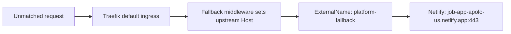

# Apolo Main: platform namespace and ExternalName routing

Live inspection date: **2026-09-07**. All platform operations were read-only.

## Access and context

Apolo MCP reported:

| Field | Value |
| --- | --- |
| Authenticated user | `olex` |
| Selected Apolo cluster | `apolo-main` |
| Selected organization/project | `compass-datacenters` / `main` |
| MCP policy | `managed` |
| Versions | `apolo_mcp 26.8.1`, `apolo_sdk 26.8.0`, `apolo_flow 26.7.2` |
| Kubernetes context | `apolo-main` |
| Underlying kubeconfig cluster name | `scottdc-compute-v2-cluster-07` |
| Inspected namespace | `platform` |

The available Apolo MCP tools expose platform resources, not raw Kubernetes Services, Ingresses, or Traefik configuration. The Apolo CLI likewise has no general Kubernetes Service command. Therefore, inspection used `kubectl --context apolo-main -n platform`, with a 20-second request timeout and bounded/filtered output.

The context uses the existing `127.0.0.1:6443` connection. It was initially unavailable; after the user restored the connection, inspection succeeded. No saved context, credentials, or tunnel configuration was changed. The selected Apolo project does not mean the Kubernetes `platform` namespace belongs to that project; this namespace contains shared platform infrastructure.

## Observed ExternalName Service

There were **59 Services** in `platform`, of which **one** was `ExternalName`:

| Field | Observed value |
| --- | --- |
| Service | `platform/platform-fallback` |
| `spec.type` | `ExternalName` |
| `spec.externalName` | `job-app-apolo-us.netlify.app` |
| Port | `https`, TCP `443`, target port `443` |
| Argo owner label | `argocd.argoproj.io/instance=apolo-main--platform-ingress` |
| Chart label | `platform-ingress-26.9.0` |
| Helm release label | `platform` |

This is the platform fallback/error-page backend. It is **not a Launchpad instance's frontend Service**. There was no Launchpad-named ingress among the 12 Ingresses inspected in `platform`; this does not establish whether Launchpad is installed in another namespace.

The live fallback ingress is `platform/platform-fallback`, with:

- `ingressClassName: traefik`.
- `defaultBackend.service.name: platform-fallback`, port name `https`.
- Router priority `1`.
- Middleware `platform-platform-fallback@kubernetescrd`.
- No host rules and no explicit per-ingress TLS section.

The live `platform-fallback` Middleware sets the upstream `Host` header to `job-app-apolo-us.netlify.app` and the response `Cache-Control` header to `no-store`. The `platform-error-page` Middleware also uses this Service for HTTP `500–599`, query `/`.



An ExternalName Service supplies a DNS alias; it does not run proxy Pods or forward packets itself. Traefik is the HTTP proxy in this flow. HTTP Host and HTTPS server-name expectations remain separate concerns. [Kubernetes Service documentation](https://kubernetes.io/docs/concepts/services-networking/service/#externalname).

### Related Launchpad source pattern

`launchpad/charts/launchpad/templates/service-client.yaml` defines `<launchpad-name>-client` as `ExternalName`, using `.Values.netlifyDomain` and HTTPS port 443. `ingress-client.yaml` routes the Launchpad hostname to that Service. `frontend-job.yaml` registers a domain alias with Netlify when configured.

This is a useful source precedent, not a claim that those objects were found in `platform`. A new static hostname targeting an in-cluster App must resolve the selected App's Service; it must not copy the Netlify destination or fallback Host rewrite.

Sources: [Launchpad Service](https://github.com/neuro-inc/launchpad/blob/867376d70fa98612f97dbb406e89d89d5e14edc4/charts/launchpad/templates/service-client.yaml), [Launchpad ingress](https://github.com/neuro-inc/launchpad/blob/867376d70fa98612f97dbb406e89d89d5e14edc4/charts/launchpad/templates/ingress-client.yaml), [platform fallback Service](https://github.com/neuro-inc/platform-operator/blob/82547152fc8dee9bc68e1a4ac3330a353ee918ba/charts/platform-ingress/templates/fallback-svc.yaml).

## Observed ingress controller and TLS

`platform/traefik` runs **`docker.io/traefik:v2.10.5`**. Its live arguments include:

```text
--providers.kubernetescrd
--providers.kubernetescrd.allowCrossNamespace=true
--providers.kubernetescrd.allowExternalNameServices=true
--providers.kubernetesingress
--providers.kubernetesingress.allowExternalNameServices=true
--entrypoints.web.http.redirections.entryPoint.to=:443
--entrypoints.web.http.redirections.entryPoint.scheme=https
--entrypoints.websecure.http.tls=true
```

Thus the requested alias backend mechanism is enabled on this cluster. This does not itself authorize cross-project access, guarantee target network-policy access, or make a target application accept the new Host header. [Traefik's provider documentation](https://doc.traefik.io/traefik/v2.10/providers/kubernetes-ingress/).

The Traefik Service is a `LoadBalancer`, exposes ports 80/443, and reports ingress IP `10.204.1.80`. Public DNS for `apolo-main.org.apolo.us` resolved to `206.125.32.48`. These are observations of the internal Service and public DNS; the intermediate forwarding/NAT configuration was not inspected.

`TLSStore platform/default` refers to `defaultCertificate.secretName: tls-cert`. Kubernetes reported that the `certificates.cert-manager.io` resource type is not installed on this compute cluster. No Secret contents were read.

Instead, a normal verified public TLS handshake to `apolo-main.org.apolo.us:443` showed a certificate valid until **2026-10-08 10:06:34 UTC**, with these DNS SANs:

```text
*.apolo-main.org.apolo.us
*.apps.apolo-main.org.apolo.us
*.clusters.apolo-main.org.apolo.us
*.jobs.apolo-main.org.apolo.us
apolo-main.org.apolo.us
```

A read-only DNS/TLS probe for the earlier installation-scoped proposal's name

```text
it196-probe.main.compass-datacenters.apps.apolo-main.org.apolo.us
```

resolved to **206.125.32.48**, but a verified TLS handshake failed with **hostname mismatch**. No App or DNS record was created for this probe.

The observed wildcard covers one label before `.apps`, not three. That explains the earlier proposal's failed probe; it does not test the revised global hostname. The global-domain design requires a certificate valid for `<static_hostname>.<global-apps-domain>`, which these cluster-domain SANs do not cover. DNS wildcard synthesis and certificate wildcard matching have different rules; one successful DNS probe does not prove another hostname resolves or has valid TLS. [RFC 9525, sections 6.3 and 7.1](https://www.rfc-editor.org/rfc/rfc9525.html#section-6.3).

The inspected infrastructure source has a central certificate path: `cloud-infra/control-plane-apps/modules/compute/certificate.tf` creates a Certificate in the configured certificate-manager namespace and annotates its Secret for Vault distribution. `modules/compute/main.tf` builds the cluster-level SAN set. The revised design should extend that mechanism for global hostnames and their current/prepared destinations, after checking its present capabilities. Placing a Certificate in this App's compute namespace alone was not a working issuance path at this baseline.

## Reproduce the core inspection

These commands only read public/resource metadata:

```sh
kubectl --context apolo-main --request-timeout=20s -n platform get services \
  -o custom-columns=NAME:.metadata.name,TYPE:.spec.type,EXTERNAL:.spec.externalName
kubectl --context apolo-main --request-timeout=20s -n platform get ingress platform-fallback \
  -o jsonpath='{.spec}{"\n"}'
kubectl --context apolo-main --request-timeout=20s -n platform get middleware platform-fallback \
  -o jsonpath='{.spec}{"\n"}'
kubectl --context apolo-main --request-timeout=20s -n platform get deployment traefik \
  -o jsonpath='{.spec.template.spec.containers[0].image}{"\n"}{.spec.template.spec.containers[0].args}{"\n"}'
kubectl --context apolo-main --request-timeout=20s -n platform get tlsstore default \
  -o jsonpath='{.spec}{"\n"}'
```

Dev cluster resources, installed customer Apps in other namespaces, target Service reachability, live Argo control-plane resources, and Terraform Cloud workspaces were not inspected. Those remain implementation validation tasks; this report establishes the live `apolo-main/platform` mechanism and its TLS limitation.

The revised [IT-196 proposal](implementation-proposal.md) uses an optional label under a global Apps domain, with persistent ownership and a changeable binding to Service Deployment's own Service. Project, organization, and cluster determine the destination and permissions, not the public name. ExternalName observations remain historical background; the proposed route uses per-host public DNS and a direct ingress-to-Service backend. Global-zone DNS control, persistent reservations, transfers, authentication recognition, multiple-host outputs, and global certificate readiness were not validated by this inspection. The listed resources, probes, and certificate remain dated observations, not evidence that the revised design is deployed.
