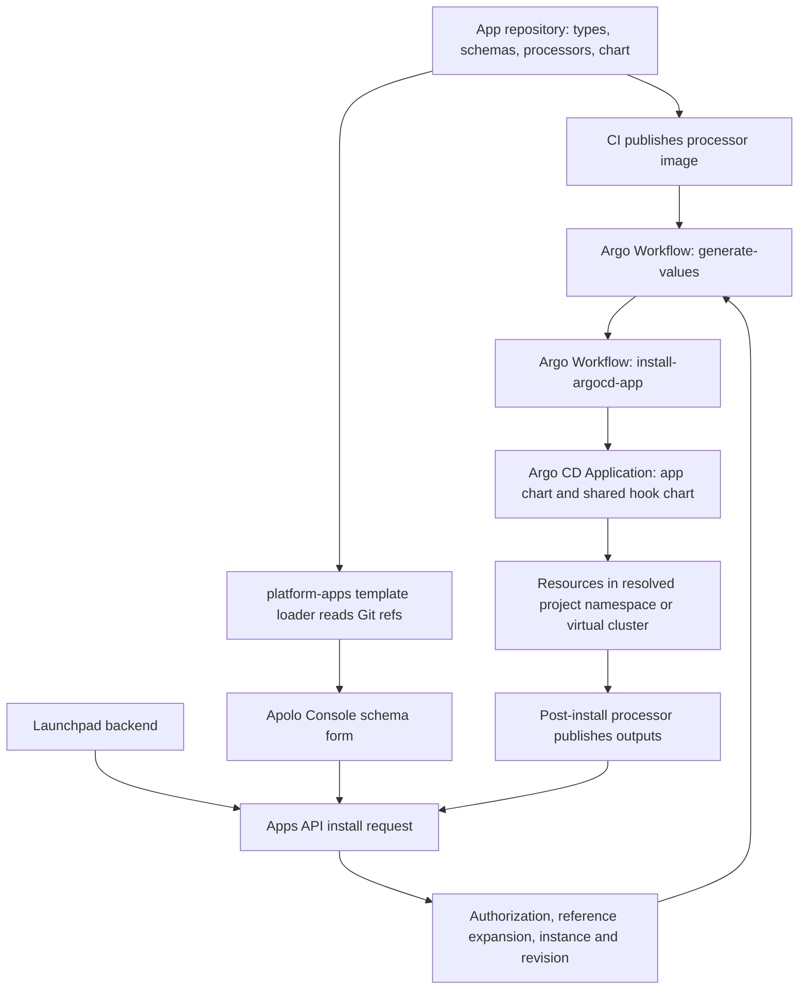

# App creation through deployment to Apolo Dev and Prod

Evidence date: **2026-09-07**. Pipeline observations below describe that source baseline; IT-196-specific paragraphs follow the proposed global-domain design. For reusable guidance, see [the generic App creation flow](../../engineering/app-development.md). Repository paths below are relative to the `apolo-services` workspace.

## Repository responsibilities

| Repository | Responsibility in the flow |
| --- | --- |
| `mlops-custom-deployment-app` | Service Deployment and related App definitions: `.apolo/applications.yaml`, Python input/output processors, generated JSON schemas, charts, and the processor image. |
| `app-types` | Shared Pydantic contracts and schema metadata, `AppType`, processor interfaces, `app-types` CLI, Kubernetes output helpers, and the shared `charts/hook` chart. |
| `platform-apps` | **Essential additional service.** Discovers templates; authenticates installation requests; resolves integration references; stores instances, configuration revisions, and links; launches workflows; tracks Argo state and outputs. |
| `neuro-web-ui` | Apolo Console schema renderer and existing custom-auth integration selector. The static hostname field uses schema rendering. |
| `launchpad` | A workflow App itself, plus a backend that imports templates/instances and delegates installations to the Apps API. Its chart packages backend/authentication/frontend routing. The requested `launchapd` directory is `launchpad`. |
| `launchpad-web-ui` | The Launchpad frontend. Calls Launchpad APIs; it is not the Apolo Console's schema/integration selector implementation. |
| `mlops-app-deployment` | Older deployer image/CLI that runs Helm or job-based applications. It is not the normal `.apolo` workflow App execution path. |
| `cloud-infra`, `platform-operator` | Platform deployment, compute-cluster registration, Traefik, DNS, certificate distribution, and workflow permissions. |
| `reuse` | Shared GitHub release and Terraform Cloud deployment workflows used by platform services. |
| `platform-ingress-auth` | At the source baseline, authorizes requests to recognized `.apps.` hostnames through `platform-apps`. IT-196 must extend recognition and lookup to the global zone. |

## End-to-end flow

### 1. Author an App

The current Service Deployment definition is the best starting point:

- `.apolo/applications.yaml` contains `app_type: service-deployment`, `install_type: workflow`, `helm_path: charts/custom-deployment`, and `app_package_name: apolo_apps_service_deployment`.
- `.apolo/src/apolo_apps_service_deployment/types.py` derives its inputs/outputs from shared `app-types` models.
- `inputs_processor.py` derives from `CustomDeploymentChartValueProcessor`; `outputs_processor.py` derives from `BaseAppOutputsProcessor` and discovers deployed URLs.
- The manifest names each schema file, Python type, processor class, and processor image repository.
- Register any new Python package in `pyproject.toml`; an extension to Service Deployment reuses its existing package. The inspected `apolo-app-types` requirement is `^26.8.1`.
- Generate schemas with the existing `app-types dump-types-schema` command, following `make gen-types-schemas`; commit the generated input and output JSON. Updating Python types alone does not update the catalog form.
- Add a new `AppType` value in `app-types` when introducing a new App identity. The template loader constructs `AppType(loaded_app_config.app_type)`, so an unknown value fails loading even if the chart exists.

For IT-196, extend Service Deployment with optional `networking.ingress_http.static_hostname`, resolved as `<static_hostname>.<global-apps-domain>`. Reuse its package, AppType, workflow, and chart. Add the authorized global host alongside the generated host, route to the deployment's own Service, and update output resolution to support both. Persistent ownership, DNS, certificates, and transfer coordination belong in the control plane; no sibling App or chart is required.

### 2. Build and discover the template

`mlops-custom-deployment-app/hooks.Dockerfile` packages `.apolo` and uses `ENTRYPOINT ["app-types"]`. Its CI builds the image `ghcr.io/neuro-inc/mlops-custom-deployment-app` after checks:

| Git event | Processor image tag | Catalog visibility |
| --- | --- | --- |
| Non-Dependabot PR | Lowercased branch name, characters outside `a-z0-9_.-` replaced by `-` | Dev can discover a branch in a configured repository; a PR image alone does not register a fork's repository. |
| Push to `master` | `master` | Dev branch version. |
| Push of `v*` tag | Exact tag, including `v` | Tagged version discoverable in Prod and Dev. |

`platform-apps/platform_apps/config.py:create_app_repositories` already registers `mlops-custom-deployment-app` and `launchpad`. A sibling App in one of these repositories does not need another repository entry.

`AppTemplateLoader` reads `.apolo/applications.yaml` or `.yml` at each Git ref, validates referenced files, loads schemas, and assigns the Git ref as `AppTemplate.version`. Processor image tags derive from that same ref. Argo CD reads the chart from Git; this App chart does not need a separate Helm registry publication step.

`app_templates_loader_tick` uses `tags_only=self._config.is_prod()`. Dev/local/test load branches and tags; Prod loads tags. `APPS_LOADER_INTERVAL_S` defaults to **600 seconds**. Allow for polling, inspect loader failures, and verify the exact version instead of assuming an image push makes the App immediately available.

**A prerelease-looking Git tag is still a tag:** the discovery code does not exclude it from Prod. Use a branch for Dev-only App testing.

### 3. Configure and submit the App

In `neuro-web-ui`, `SchemaAppIntegrations` and `SchemaAppIntegrationsModal` use schema type/integration metadata and `getPlatformAppIntegrationValuesByTypes`. The latest remote implementation supports multiple integration type names and obtains cluster/organization/project from the Console context.

The Service Deployment custom-auth pattern is:

1. `CustomAuth.middleware` is an integration field of type `AuthIngressMiddleware`.
2. The UI queries eligible integration outputs and displays installed instances.
3. The submitted value references an instance and output path: `{"type":"app-instance-ref","instance_id":"<UUID>","path":"$.auth_middleware"}`.
4. `platform-apps` resolves the reference under the request's cluster/organization/project and records an `AppInstanceLink`.

This is a typed-output picker, not an unrestricted Kubernetes Service picker. Ordinary `AppOutputs.app_url`/`WebApp` metadata is inline, whereas the integration query explicitly filters `meta_type="integration"`. Merely adding a `WebApp` input does not guarantee eligible choices appear.

For IT-196, the schema form adds a single optional hostname label to Service Deployment's HTTP ingress settings. The public suffix comes from the environment's global zone; installation context determines the destination and authorization only. The integration picker needs no target-selection changes. Claim or bind an unbound owned reservation during installation; an already-bound name requires an explicit authorized transfer operation. Preserve custom-auth behavior and enforce [reservation ownership](implementation-proposal.md#reservation-ownership-and-binding) and [global-hostname authentication](implementation-proposal.md#hostname-ownership-and-authentication) server-side.

Launchpad follows a separate frontend/backend path. `launchpad/launchpad/ext/apps_api.py` delegates to the same Apps API with its configured cluster/org/project. `launchpad/launchpad/apps/service.py` imports templates, merges/configures inputs, and calls that client. It does not replace the central template loader or Argo deployment machinery.

### 4. Execute the workflow and Argo CD deployment

`platform-apps/platform_apps/app_instances/service.py:install_app` creates an instance, initial revision, lifecycle event, and dependency links. It resolves the namespace and Argo destination using project metadata; ordinary projects and virtual Kubernetes projects have different destinations. Do not reconstruct a namespace from a display name.

For `InstallType.WORKFLOW`, the API submits `platform-apps/resources/workflow.yaml`:

1. **`generate-values`:** runs the App's processor image and `app-types run-preprocessor` with resolved context and user inputs. Produces Helm values/arguments and the installed `apolo-app-types` version.
2. **`install-argocd-app`:** applies an Argo CD `Application` with two sources: the App repository/chart at the selected Git ref, and `app-types/charts/hook` at the version reported by the processor environment.
3. **Argo CD reconciliation:** creates chart resources and the hook resources at the destination. The inspected workflow sets `CreateNamespace=true`, automated sync, and default `prune: false`, `selfHeal: false`. Its explicit update/force-sync path can request pruning.
4. **Output hook:** the shared chart runs the App's output processor and publishes typed outputs to the Apps API. The shared hook Role permits namespaced reads of Services, Pods, Endpoints, Ingresses, and other declared resources; it does not automatically provide arbitrary cross-project access.
5. **Lifecycle:** the Apps service exposes state, events, output URLs, updates, rollback, and uninstall. Review successful workflow submission, Argo sync/health, and output publication separately.

The older `InstallType.MLOPS` path generates values in the API and creates Argo Applications directly; its shared hook source currently tracks `master`. `mlops-app-deployment/HelmManager` instead invokes `helm upgrade --install --wait`. IT-196 extends the existing Service Deployment workflow instead.

## Release sequence: Dev, then Prod

### Shared dependencies and platform changes

1. Release required `app-types` changes first. A `v*` tag publishes the Python package to PyPI and the versioned hook image/chart source. Bump affected consumer requirements and lockfiles. A new enum member must reach both the API loader and processor image before the new manifest is usable.
2. Deploy required `platform-apps` changes to Dev. Its CI invokes `reuse` **at `v26.8.0`**, publishes the service image/chart, and passes `platform_apps_version` to the deployment workflow.
3. That workflow uses `DEV_TFC_WORKSPACE_JSON` for Dev and `PROD_TFC_WORKSPACES_JSON` for Prod. Dev requests a Terraform Cloud run with `apply: true`; Prod requests runs with `apply: false`. Production planning is not proof of an applied deployment. Workspace values and live rollout status were not inspected here.
4. For Console changes, use `neuro-web-ui`'s current development/release workflow; its latest `AGENTS.md` specifies `development` as the normal implementation base. Do not assume a Python service release deploys either frontend. The inspected `launchpad-web-ui` GitHub workflows contain PR linting, not a demonstrated Dev/Prod deployment pipeline; Netlify deployment configuration requires separate verification if that frontend changes.
5. Roll out separate Dev/Prod global DNS zones, scoped DNS integration, certificate issuance/distribution, and ingress support through `cloud-infra`/`platform-operator`. Deploy the reservation/binding reconciler and global-zone authentication before enabling the input. The chosen domains and live support are not established by this source audit.

### App release

1. Push a task branch in the registered App repository; wait for its processor image build and catalog discovery in Dev.
2. Install that exact Service Deployment branch version in the Dev global zone. Verify omitted/supplied hostname behavior, both URLs/outputs, unique claims, persistent ownership after uninstall, HTTPS, authentication, and failed/stale operations. Test authorized transfers across projects/organizations and at least two destinations, including different clusters and a shared ingress controller, with DNS-cache handling and the proposal's permitted cutover interruption.
3. Merge reviewed changes, then create a versioned `v*` App tag only when the corresponding platform dependencies are ready in Prod. Verify the exact image tag and catalog version before installation.
4. Install the tagged App in the intended Prod project and verify its global hostname and active binding. Dev credentials must not control production records. Publishing a template does not install an instance or upgrade every existing instance.
5. Keep the tested chart ref, processor image, shared `app-types` version, and reservation/binding generation recorded together. App revision rollback must revalidate current hostname ownership; DNS/binding rollback is a separate authorized operation. Do not move a release tag to change a released App.

## Source revision audit

GitHub was checked with read-only `gh api`; no checkout was pulled/reset. Existing local modifications in `launchpad-web-ui` and the untracked `app-types/DEPENDENCY_FLOW.md` were preserved.

| Repository | Local revision | Remote `master` at inspection | Relevant result |
| --- | --- | --- | --- |
| `mlops-custom-deployment-app` | `5701223550ea0060713799d299a51ef516220ae7` | `e4e2b16fc436563542266221a9a5a67666bd262e` | Five dependency updates; only `poetry.lock` differs. |
| `launchpad` | `867376d70fa98612f97dbb406e89d89d5e14edc4` | Same | Current. |
| `launchpad-web-ui` | `4f42718de6ecca2a18fe461891026a6094282a89` | Same | Current committed revision; user changes preserved. |
| `mlops-app-deployment` | `e81d56044f8aeed3750ca57d28c6cabe0389f356` | Same | Current. |
| `app-types` | `ab144d9baf651b2a28d83963bdf59239f6b0ec77` | Same | Current. |
| `platform-apps` | `f03d726d1b1f8b345842661234bb9e3e8708de1e` | `8a3e79448bb0204ecaef53033414063950b66c57` | Local is ahead of its tracking ref; GitHub comparison of local SHA returned 404. Downloaded remote service, validation, workflow client, config, and CI files match local bytes. |
| `neuro-web-ui` | `374acccaa42c1757b00f8b6394a8659e60113402` | `7841c69dc690127188515a618a1d2b3a271cb298` | Two releases ahead; inspected the newer integration picker files. |
| `cloud-infra` | `dc4724f284198388465ba91997931a979a34ba1e` | `1e306c80ba495bf0bb70c10212822c565546b499` | Local is on `ns-baseline-warnings`, diverged from master. Relevant current infrastructure files were read separately. |
| `reuse` | `57eec34020c34897e8eb424ddabd80c833d212e5` | `4e1146fa5488ad3a4aa9a3f8746c4bbd9df245dd` | Read the actually referenced `v26.8.0` release/deploy workflows. |
| `platform-operator` | `f66bba00c5c147b0261a80c4f0f7122163c296a0` | `82547152fc8dee9bc68e1a4ac3330a353ee918ba` | Relevant current fallback Service/Ingress and Traefik Application templates match local. |
| `platform-ingress-auth` | `c47d3f0644c685cf319bd4513c275a8c39d68ab4` | `722da0b1628f4b6dbea4f6c777fdec6f64fbb679` | Remote has app-hostname authorization absent from the old local OAuth file; used remote behavior. |

### Primary source entry points

- [Service Deployment manifest](https://github.com/neuro-inc/mlops-custom-deployment-app/blob/e4e2b16fc436563542266221a9a5a67666bd262e/.apolo/applications.yaml), [App CI](https://github.com/neuro-inc/mlops-custom-deployment-app/blob/e4e2b16fc436563542266221a9a5a67666bd262e/.github/workflows/ci.yaml).
- [Template loader](https://github.com/neuro-inc/platform-apps/blob/8a3e79448bb0204ecaef53033414063950b66c57/platform_apps/app_templates/services/app_template_loader.py), [instance service](https://github.com/neuro-inc/platform-apps/blob/8a3e79448bb0204ecaef53033414063950b66c57/platform_apps/app_instances/service.py), [workflow](https://github.com/neuro-inc/platform-apps/blob/8a3e79448bb0204ecaef53033414063950b66c57/resources/workflow.yaml).
- [Current integration picker](https://github.com/neuro-inc/neuro-web-ui/blob/7841c69dc690127188515a618a1d2b3a271cb298/src/components/Schema/SchemaAppIntegrations/SchemaAppIntegrationsModal.tsx), [reference validation](https://github.com/neuro-inc/platform-apps/blob/8a3e79448bb0204ecaef53033414063950b66c57/platform_apps/app_instances/validation.py).
- [Shared package release](https://github.com/neuro-inc/app-types/blob/ab144d9baf651b2a28d83963bdf59239f6b0ec77/.github/workflows/ci.yaml), [service deployment workflow at the referenced version](https://github.com/neuro-inc/reuse/blob/v26.8.0/.github/workflows/deploy-service.yaml).
