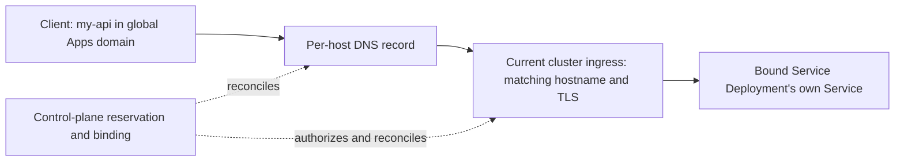

# IT-196: global static hostname for Service Deployment

Implement an optional static hostname for container images installed through the existing **Service Deployment** App. The public name is independent of project, organization, cluster, and App instance; a persistent control-plane reservation binds it to the current Service Deployment. This supersedes the installation-scoped hostname and standalone alias-App proposals.

## Input and public identity

Keep one optional Service Deployment input:

```yaml
networking:
  ingress_http:
    static_hostname: my-api
```

Resolve it against a configured, Apolo-managed global Apps DNS zone:

```text
<static_hostname>.<global-apps-domain>
```

Use `my-api.apps.apolo.us` in Prod and `my-api.apps.dev.apolo.us` in Dev. These suffixes follow the verified `cloud-infra` zone and wildcard certificate declarations; destination routing and certificate installation remain rollout prerequisites. The production suffix is shared across participating clusters and contains no project, organization, or cluster identifiers. Store the full reserved hostname; changing a platform label or default domain configuration must not rewrite existing names. Retain DNS ownership and certificate support for previously issued names.

The destination's cluster, organization, project, instance, namespace, and Service still come from trusted platform metadata. They determine routing and authorization, not the public hostname. Add no target selectors to the ordinary installation form. User-owned custom domains and a global HTTP proxy are outside this implementation; an Apolo-owned suffix remains dependent on Apolo retaining that domain.

- Omitted or null `static_hostname` preserves existing behavior on initial installation. Removing it from an installation detaches its static route and retains the reservation for its owner.
- Require enabled HTTP ingress and an internal Service. Validate a single 1–63 character lowercase ASCII DNS label with alphanumeric ends and optional internal hyphens. Reject explicit blanks, dots, slashes, wildcards, whitespace, underscores and invalid full hostname lengths; do not silently rewrite input.
- Keep the generated URL and add the static host to the same Service, paths, and ports. Preserve the selected Apolo/custom/no-auth policy on both routes.
- Accept the field only for `service-deployment`, in both generated schemas and server validation. It identifies this deployment's desired hostname, not another App's Service or an image-wide alias.
- A fresh claim creates a reservation. The owner can bind an unbound reservation to a new Service Deployment. Entering an already-bound name does not steal or transfer it; use the authorized transfer operation below.

## Reservation, ownership, and binding

`platform-apps` owns a durable registry outside compute-cluster resources and App/project deletion cascades. All controllers serving the same public zone must share one authoritative registry. A reservation records the canonical full hostname, a stable owning principal ID, the current deployment binding (or none), and a generation used to reject stale operations. Store operation progress sufficiently to reconcile DNS, ingress, and certificate changes after retries or restarts.

Ownership is an authorization relationship, not a project/org name embedded in DNS. Use existing platform identities and permissions; record binding scope with stable resource IDs. Rebinding across projects or organizations requires hostname-management authority and explicit authorization for both affected deployments. Transferring hostname ownership is a separate authorized action, never an automatic consequence of moving its binding.

- Enforce canonical-hostname uniqueness transactionally across the zone. Concurrent claims have one winner; retries for the same operation are idempotent. Check existing DNS/ingress conflicts, including unmanaged resources, before activating a claim.
- Serialize binding changes using an expected binding/generation. Only the control-plane reconciler may publish DNS or grant a chart an active hostname binding. A processor's list-then-create check cannot arbitrate ownership.
- Detach on field removal, uninstall, or target project/organization deletion: withdraw the route and DNS and clear the binding, but retain ownership. Image updates, scaling, and label renames preserve the reservation and binding.
- If an owning principal is deleted or loses all authorized managers, retain a non-serving reservation for administrative recovery or explicit release. Do not silently transfer it or make it available for another tenant to claim.
- Renaming claims the replacement before switching; the old name remains reserved after detachment. Failed installation/binding attempts leave the operation recoverable and must not release a pre-existing reservation.
- Explicit release requires hostname-management permission, no active or pending binding, confirmed removal of all managed routes and DNS, and a reuse quarantine covering published DNS TTLs and connection-drain policy. Persist that policy and retain claims if cleanup cannot be confirmed.
- An old App revision, delayed workflow, rollback, or uninstall must not recreate a transferred hostname or delete its new destination. Revalidate binding generation before applying chart values, DNS changes, or outputs; reconcile stale Argo desired state as well as live resources. Rolling back App code does not roll back hostname ownership.

## DNS routing and reconciliation

Use a per-host DNS record pointing to the active cluster's public ingress endpoint. Prefer CNAME when the platform provides a suitable ingress DNS name; use managed A/AAAA records when only addresses are available. The target may change while the public name stays fixed. A wildcard pointing at one cluster cannot direct independent hostnames to different clusters.



Reuse the existing DNS provider and certificate distribution integration. Keep DNS credentials in the control plane; charts/processors receive validated resolved values, never zone credentials. Reconcile intended and observed state with bounded retries, operation events, and an explicit failed/pending status. A committed database binding alone does not establish endpoint readiness.

DNS aliases preserve the hostname the client uses for HTTP and TLS. The destination ingress must have an explicit rule and a matching certificate for the global hostname. The chart routes directly to its own Service; no Kubernetes ExternalName Service or separate proxy workload is needed. [Kubernetes Ingress](https://kubernetes.io/docs/concepts/services-networking/ingress/#tls), [ExternalName hostname considerations](https://kubernetes.io/docs/concepts/services-networking/service/#externalname).

## Transfer and migration

Provide an explicit, auditable Apps API operation to transfer an existing reservation to a replacement **Service Deployment** instance. The request identifies the reservation, expected current binding/generation, and destination instance; the server resolves infrastructure metadata and validates permissions. Initial installation still binds only its own Service. A separate alias App or target picker is unnecessary.

1. Create the destination deployment using its generated URL. Verify its application state, Service, ingress reachability, and required data migration separately; moving a hostname does not migrate data.
2. Authorize and record the transfer. Prepare the destination certificate and route configuration without serving the static hostname before the binding permits it. Lower DNS TTL sufficiently ahead of cutover when reducing an existing TTL; previously cached records retain their earlier lifetime.
3. Quiesce the old static route and confirm it no longer serves the old workload before activating the replacement binding. If the source cluster is unreachable, keep the transfer pending unless the old route can be verifiably fenced. A database update alone cannot withdraw cached traffic.
4. Activate the destination binding and matching ingress, update the authoritative DNS record, and verify the public endpoint. For two deployments behind the same ingress controller, replace the host rule without leaving competing same-host routes. Track incomplete steps and reconcile them; these external changes are not one atomic database transaction.
5. Retain control of the old ingress destination through the DNS-cache and connection-drain window; stale traffic must fail closed, not reach a different workload. Clean up the retired static route and clear stale outputs/configuration. Keep ownership and the full hostname unchanged.

This initial design permits a bounded interruption during cutover and DNS convergence; it does not promise zero downtime. Quiescing the old route prevents the hostname's new authorization policy from exposing the previous workload to a different audience. Rollback is another authorized binding operation using the same checks, not a blind restoration of an old chart or DNS record. [DNS TTL and caching](https://www.rfc-editor.org/rfc/rfc1034.html#section-3.6).

## Extend the existing App and outputs

At the recorded source baseline, `ServiceDeploymentInputs` inherits `CustomDeploymentInputs`, and its input processor subclasses `CustomDeploymentChartValueProcessor`. Add Service Deployment-specific networking/HTTP-ingress models; do not expose the field globally to all `IngressHttp` consumers. Update its input/output processors and generated schemas, reusing the package, manifest, AppType, workflow, and `charts/custom-deployment` chart.

Keep the workload chart's generated host unchanged. A separate control-plane-owned Argo Application renders the authorized global route with the same observed HTTP paths, owned Service, and authentication middleware. It supplies the certificate reference and a final generation guard. Workload updates cannot create that resource.

The inspected `get_ingress_host_port` rejects multiple rules in one Ingress. The separate route avoids changing this shared contract: the workload still has one generated hostname. Keep `app_url` as that URL; the Apps API derives optional `static_url` from the verified active registry binding and ignores stale workflow-provided values. Binding status exposes pending/error state separately.

Sources: [Service Deployment types](https://github.com/neuro-inc/mlops-custom-deployment-app/blob/e4e2b16fc436563542266221a9a5a67666bd262e/.apolo/src/apolo_apps_service_deployment/types.py), [input processor](https://github.com/neuro-inc/mlops-custom-deployment-app/blob/e4e2b16fc436563542266221a9a5a67666bd262e/.apolo/src/apolo_apps_service_deployment/inputs_processor.py), [Ingress template](https://github.com/neuro-inc/mlops-custom-deployment-app/blob/e4e2b16fc436563542266221a9a5a67666bd262e/charts/custom-deployment/templates/ingress.yaml), [output helper](https://github.com/neuro-inc/app-types/blob/ab144d9baf651b2a28d83963bdf59239f6b0ec77/src/apolo_app_types/outputs/utils/ingress.py).

## Hostname ownership and authentication

Resolve the canonical global hostname through its active reservation binding to the current instance and scope, then enforce that deployment's existing access policy. A reservation grants management rights to its owner, not application access to callers. Inactive, unknown, stale, or inconsistent bindings fail closed. Keep generated-hostname lookup working.

The inspected Apps API lookup parses the first label as `<type>--<UUID>` or an internal App name. The ingress authentication path also recognizes existing platform domain patterns. Extend both hostname resolution and domain recognition for the configured global zone; do not assume that a new suffix will reach the existing `.apps.` authentication branch. Accept only configured zones and trusted binding metadata, not user-supplied scope headers.

Check Apolo/custom/no-auth parity, login redirects, callback/allowed-host settings, cookie domains, application base URLs, and upstream Host expectations. During a transfer, authorize the actual serving deployment: never use the destination's permissions to authorize requests still served by the old instance. The quiesce-before-rebind sequence above is the baseline safeguard. Do not copy the platform fallback's Netlify Host rewrite.

Source: [Apps hostname lookup](https://github.com/neuro-inc/platform-apps/blob/8a3e79448bb0204ecaef53033414063950b66c57/platform_apps/app_instances/api_v2.py). The [platform investigation](apolo-main-platform.md) records historical observations and their limits.

## TLS, environments, and release

Provision a certificate valid for the exact global hostname in the active cluster before serving it, using the existing control-plane issuance/distribution mechanism where supported. A single-label global scheme can use `*.<global-apps-domain>`, but distributing one wildcard private key to every cluster grants each holder authority over every hostname in that zone. Prefer centrally issued per-host certificates distributed only to current/prepared destinations. Define renewal, transfer, removal, and issuer-failure behavior before rollout; charts must not obtain DNS credentials.

The historical Apolo Main certificate covered cluster-specific domains, not the proposed global zone. No Certificate CRD was present on that compute cluster. Revalidate current infrastructure; a Certificate resource added to this chart alone is not a demonstrated issuance path. DNS success does not prove TLS readiness. [TLS hostname matching](https://www.rfc-editor.org/rfc/rfc9525.html#section-6.3).

Use separate Dev and Prod global zones and isolated DNS credentials/registries. "Global" means shared across participating clusters within that environment. Dev cannot claim or modify production hostnames. Preserve issued production names when clusters or platform configuration change.

No shared `app-types` change is required by this implementation. Regenerate the Service Deployment schemas with its locked dependency and publish the static-route chart at a reviewed commit. Deploy registry/reconciliation, authentication, DNS, and certificate prerequisites to Dev before testing a Service Deployment branch. Validate at least two destinations and the cross-scope transfer paths before promoting dependencies and a tested App tag to Prod. Catalog publication does not update existing instances. Follow [the generic creation/release flow](../../engineering/app-development.md) and [ticket release details](app-creation-flow.md).

## Changes by repository

| Repository | Change |
| --- | --- |
| `mlops-custom-deployment-app` | Service Deployment-only input/output models, generated schemas, and compatibility checks; workload processors/chart stay unchanged. |
| `app-types` | Unchanged: the separate control-plane route preserves existing helper behavior and AppType. |
| `platform-apps` | Global reservation ownership, binding/transfer/release API, generation checks, lifecycle reconciliation and status, DNS coordination, canonical-hostname resolution, and stale-output cleanup. |
| `cloud-infra` / `platform-operator` | Opt-in control-plane configuration and scoped DNS/cluster-reader secrets. Operators configure existing destination certificate issuance/distribution/renewal before enabling a cluster. |
| `neuro-web-ui` | Optional field/output and clear conflict/pending/failure presentation. No target selectors in the ordinary form; API transfer support is sufficient initially. |
| `platform-ingress-auth` | Global-zone recognition, authoritative active-binding lookup, and authentication parity/fail-closed behavior. |

## Acceptance checks

| Check | Required result |
| --- | --- |
| Scope and compatibility | Only Service Deployment accepts the input; generated URLs, omitted fields, old revisions, and other Apps retain their behavior. |
| Public identity | Full hostname contains no installation identifiers and stays unchanged across image changes, label renames, authorized project/org/cluster transfers, and replacement instances. Changing default zone configuration does not rewrite issued names. |
| Validation and isolation | Invalid/reserved labels, unsupported App types, disabled HTTP ingress/Service, forged scope, unmanaged conflicts, and Dev attempts to modify Prod DNS fail clearly. |
| Reservation concurrency | Concurrent global claims have one owner; retries are idempotent; stale generations and concurrent transfers cannot steal or overwrite a binding. |
| Ownership lifetime | Detach, rename, failed binding, uninstall, target deletion, and owner deletion preserve the documented reservation/recovery behavior. Explicit release waits for verified cleanup and quarantine. |
| Routing and output | Generated and static URLs route to the authorized instance's own Service; multi-host output selection is deterministic; pending or retired bindings are not advertised as ready. |
| Migration | Test different clusters and shared ingress destinations, source/destination authorization, TLS preparation, cached DNS, unreachable source, quiescence, partial DNS/ingress failures, retry, and rollback. Stale traffic cannot reach another tenant's workload. |
| Authentication | Both URLs enforce the selected policy; global-zone lookup, custom callbacks/cookies, transfers with different audiences, and unknown/inactive bindings behave correctly. |
| TLS | Verified hostname/SNI, DNS, issuance, renewal, destination certificate installation, and issuer/distribution failures are covered. Existing cluster certificates are not assumed valid for the global zone. |
| Reconciliation | A delayed workflow, old revision rollback, source uninstall, or controller restart cannot restore an obsolete route, remove a new binding, or publish stale outputs. |

The implementation selects the verified Apolo Apps suffixes, uses the existing authenticated `User.name` owner identity, and defaults to a one-hour quarantine after confirmed cleanup (minimum ten minutes). Before rollout, provision scoped provider/reader credentials, validate certificate delivery and ingress exclusivity, and confirm the quarantine against DNS/drain behavior. These are rollout configuration/authorization decisions, not optional org/project fields in the App form.

Use focused model/processor/output/API tests, chart render/lint checks, and Dev end-to-end validation before promotion. Source implementation and focused tests are present; live global-domain deployment remains unvalidated. The controller records transfer input revisions and preserves registry identity across code rollback. Every route ends its authentication chain with an uncached generation guard, including public routes. See [implementation architecture](../../../../platform-apps/docs/architecture/static-hostnames.md) and [configuration/rollout](../../../../platform-apps/docs/operations/static-hostnames.md). These links assume sibling repositories.
