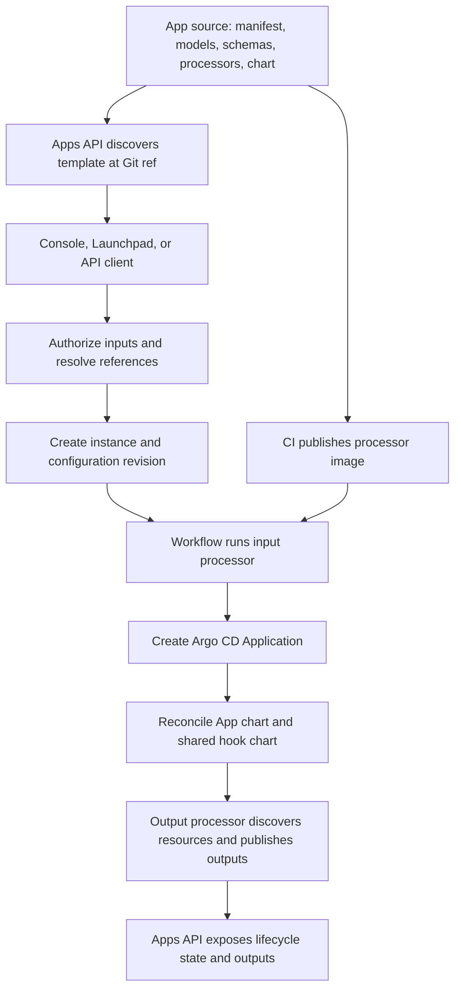

# App development

This guide covers creating or extending an Apolo workflow App, from source changes to installation in Apolo Dev and Prod. Service Deployment provides a working example; choose the closest compatible App for other use cases. Check the current manifests, dependencies, and CI before a release because each repository has its own lifecycle.

For shared release coordination, see [Deployment and release coordination](../../../apolo-agent-harness/docs/operations/deployment.md).

## Components and responsibilities

| Repository | Role |
| --- | --- |
| `mlops-custom-deployment-app` | App manifests, Python input/output models and processors, generated schemas, Helm charts, and the processor image. |
| `app-types` | Shared contracts, `AppType`, processor interfaces, schema generation, Kubernetes output helpers, and the shared output-hook chart. |
| `platform-apps` | Template discovery, installation authorization, reference resolution, instance revisions, workflow submission, and lifecycle/output tracking. |
| `neuro-web-ui` | Apolo Console forms generated from App schemas and selectors for typed integration outputs. |
| `launchpad`, `launchpad-web-ui` | Launchpad backend/frontend. The backend consumes the Apps API; Launchpad is also a workflow App. |
| `cloud-infra`, `platform-operator`, `reuse` | Platform configuration, cluster infrastructure, and shared service release/deployment workflows when changes require them. |

`mlops-app-deployment` implements an older Helm/job deployment path. It does not need changes for an ordinary workflow App.



## 1. Author the App

Start with [the manifest](../../.apolo/applications.yaml) and the [Service Deployment package](../../.apolo/src/apolo_apps_service_deployment). Extend an existing App when its identity and lifecycle fit; introduce a new App only when it needs a distinct contract.

1. Define input and output models in the App's `.apolo/src/` package. Reuse appropriate `app-types` contracts; keep App-specific fields local so unrelated Apps do not inherit them.
2. Implement input processing into Helm values and output processing from deployed resources. Service Deployment inherits `CustomDeploymentChartValueProcessor`; other Apps can use the appropriate base processor without inheriting image/preset inputs they do not need.
3. Reuse or add a chart under `charts/`. Derive namespace, cluster destination, and other infrastructure context from platform metadata. Ensure the output processor can identify the chart's resources and has the required read permissions.
4. Register the package in [pyproject.toml](../../pyproject.toml). Add or update the manifest entry: App name/type, `install_type: workflow`, chart path, Python package, input/output type and processor names, schema paths, and processor image repository.
5. For a new App identity, add the required `AppType` value in `app-types`. The template loader constructs this enum; a manifest with an unknown type cannot load. Existing App extensions reuse their identity.
6. Add any new model/schema pairs to [the Makefile](../../Makefile), regenerate input and output JSON schemas, and commit them with the Python changes. The catalog reads these files; changing Python alone does not update the form.

Keep the manifest, importable classes, schemas, chart, and image consistent. [hooks.Dockerfile](../../hooks.Dockerfile) packages the `.apolo` code with `apolo-app-types` and uses the `app-types` entrypoint.

## 2. Validate source and contracts

Use the repository's supported Python/Poetry versions and its configured development environment. Existing commands, run from this repository root, include:

```sh
poetry run make gen-types-schemas
make lint
make test-unit
```

Review generated changes; `make lint` includes formatting hooks that can modify files. Follow [the test workflow](../../.github/workflows/test.yaml) for required checks and prepare the configured environment before integration tests.

Verify input validation, representative input-to-values behavior, rendered chart resources, and typed output generation. Test affected failure and lifecycle cases, such as invalid references, updates, rollback, or cleanup. Preserve existing defaults and schema/output compatibility when extending an App.

For an App that consumes another App's output, use schema integration metadata and the existing `app-instance-ref` resolution path. Console selectors discover compatible typed integration outputs; an ordinary URL output is not automatically an integration. The Apps API must authorize reference scope and preserve dependency links. Frontend filtering alone is insufficient.

## 3. Publish a Dev version and verify discovery

[This repository's CI](../../.github/workflows/ci.yaml) checks the source and builds `ghcr.io/neuro-inc/mlops-custom-deployment-app`:

| Source event | Processor image tag |
| --- | --- |
| Non-Dependabot pull request targeting `master` | Lowercased branch name, with characters outside `a-z0-9_.-` replaced by `-`. |
| Push to `master` | `master`. |
| Push of a `v*` tag | The exact Git tag, including `v`. |

`platform-apps` discovers templates from repositories registered in `create_app_repositories`. A new manifest entry in an existing repository normally needs no additional repository registration. A new repository does; publishing its image alone does not register it, and a fork PR does not register the fork.

The loader reads `.apolo/applications.yaml` or `.yml` at a Git ref, loads its schemas, and uses that ref as the template version. The processor image must have the corresponding tag. Argo CD reads the App chart directly from Git, so this workflow does not require separate Helm registry publication for the App chart.

Dev/local/test discovery includes branches and tags; Prod discovery uses tags only. Use a discoverable branch for Dev-only testing: a prerelease-looking tag is still eligible for Prod discovery. Allow for loader polling and verify the exact catalog version and processor image before installation.

## 4. Install and inspect the workflow in Dev

Resolve the intended cluster, organization, project, template, and version. The Console renders the schema form; Launchpad delegates through its own backend; API clients can submit inputs directly. All paths rely on Apps API authorization and validation.

For a workflow App, installation proceeds as follows:

1. `platform-apps` resolves references, records the instance and configuration revision, and determines the project namespace and Argo destination. Ordinary and virtual Kubernetes projects can have different mappings.
2. The `generate-values` workflow step runs `app-types run-preprocessor` in the App's processor image. It produces Helm values/arguments and reports the installed `apolo-app-types` version.
3. `install-argocd-app` creates an Argo CD Application using the App chart at the selected Git ref and `app-types/charts/hook` at the version reported by the processor.
4. Argo CD reconciles the resources. Inspect the active workflow's sync/prune settings when changing resource lifecycle behavior rather than assuming every update removes obsolete resources.
5. The shared output hook runs the App's output processor and publishes typed outputs to the Apps API. Its namespaced permissions must cover the required resources; cross-project access is not implicit.

Verify workflow completion, Argo sync/health, output publication, and actual application behavior separately. For HTTP Apps, check HTTPS and the configured authentication behavior. Exercise the lifecycle paths changed by the feature and inspect bounded events/logs for failures. A submitted installation or healthy Argo Application alone does not prove the user-facing endpoint works.

## 5. Promote dependencies and the App to Prod

Release only the components that changed, in dependency order:

1. Publish required `app-types` changes, then update affected consumer requirements and lockfiles. A new enum or shared contract must reach the API loader and processor runtime before a manifest relies on it. Keep the Python package, hook image, and hook chart version compatible.
2. Deploy prerequisite API, Console, or infrastructure changes to Dev through their own pipelines, then validate the App's branch version there. A Python service release does not deploy either frontend.
3. Promote prerequisites to Prod before publishing an App version that needs them. For platform services using `reuse`, inspect the exact pinned deployment workflow and its target workspaces. A successful Terraform planning run does not prove a rollout was applied.
4. Merge reviewed App changes and publish a versioned `v*` tag for the tested source. Wait for its processor image and verify exact catalog discovery in Prod. Keep published tags immutable.
5. Install or update the intended Prod instance to that version, then repeat the relevant workflow, output, endpoint, and lifecycle checks. Catalog publication does not install an App or upgrade existing instances automatically.

For each validated release, record the chart Git ref, processor image, shared package/hook version, instance revision, installation context, and check results. Use the Apps API's instance revision/update/rollback path when recovery is needed, accounting for any application-specific data changes; do not move a Git tag to replace a released version.

## Source entry points

For cross-repository changes, inspect these paths in the relevant checkout:

- `app-types`: `src/apolo_app_types/app_types.py`, processor and output helpers, `charts/hook/`, and `.github/workflows/ci.yaml`.
- `platform-apps`: `platform_apps/config.py`, `platform_apps/app_templates/services/app_template_loader.py`, `platform_apps/app_instances/service.py`, `platform_apps/app_instances/validation.py`, and `resources/workflow.yaml`.
- `neuro-web-ui`: `src/components/Schema/` and `src/services/platformApps.services.ts`.
- `launchpad`: `launchpad/ext/apps_api.py` and `launchpad/apps/service.py`.

Read each repository's instructions and current release configuration before applying this flow to a change.
